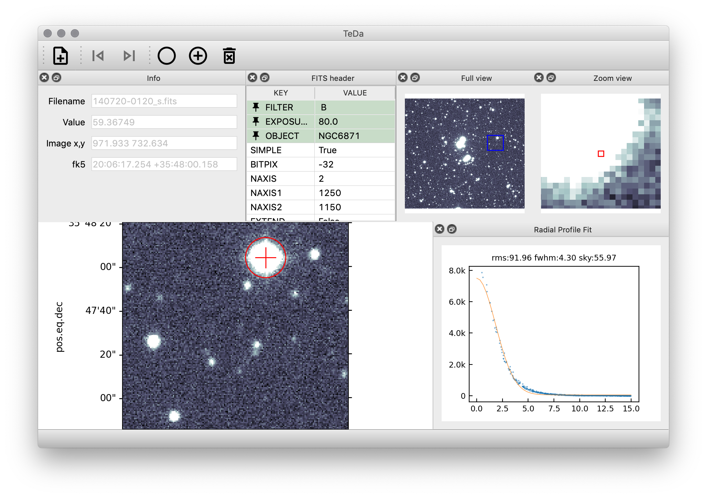

# TeDa FITS Viewer

Observatory optimized FITS Images viewer



## Key Features
* Flexible windows and widgets layout
* WCS support
* Radial Profile with gaussoide fit (try `r`-key)
* Scan mode: observes directory for changes and automatically opens new FITS
* Integrated ipython console with direct access to data and application

## Installation
``` bash
   pip install teda
   teda_viewer 
``` 
### Optional dependencies
To use ipython console the `qtconsole` package is needed, additionally:
``` bash
    pip install qtconsole
``` 
For directory scanning functionality, the `watchdog` package should be installed, e.g. 
``` bash
    pip install watchdog
``` 

## Run
The installation scripts should install the command:
```
    teda_viewer
```
Try 
```
    teda_viewer --help
```
for list of command line parameters.

## Dynamic Scale and Color
The dynamic scale of the image, and color mapping can be adjusted form 
the **Dynamic Scale** panel. From menu: **View/Dynamic Scale**

## Fits Header Cards Pinning
On the FITS Header panel, selected keys can be *pinned* to appear
on the top ot the list. This can be done via context (right-click) menu.

The set of pinned keys is saved and preserved between sessions.  

## Radial Profile
The **Radial Profile** button turns on the mode of selecting targets for 
the radial profile analysis. Make sure the radial profile panel is visible 
(View/Radial Profile). The shortcut for displaying radial profile of the star 
under cursor is the **R**-key.

The centroid of the star is corrected within small (be precise!) radius
using the bivariate gaussoide fit.

Together with the pixels values, the radial profile presents 1D fit of
"gaussian(r) + sky". This fit provides information of presented fwhm and sky level.
   

## Integrated Python Console
In order to use integrated python console the `qtconsole` module, and it's
dependencies (jupyter related) have to be installed. This is not done by
default `pip` installation to keep number of dependencies reasonably small.
Install `qtconsole` by:
``` bash
    pip install qtconsole
``` 

The console is available form menu **View/Python Console**
### Predefined variables
The console has a number of predefined variables set:
* `ax: WCSAxesSubplot` main plotting axes.
* `window: MainWindow` main window
* `data: numpy.ndarray` current HDU data
* `header: astropy.fits.Header` current HDU header
* `wcs: astropy.wcs.WCS` the WCS transformer

### Plotting
To plot directly on the console, run the following magic command `%matplotlib inline`.

When plotting on the main canvas, the result will appear after redrawing
main figure by `ax.figure.canvas.draw()`.

The example below, draws linear profile on the console and corresponding
line on the main FITS display:    
  
``` python
%matplotlib inline
import matplotlib.pyplot as plt
ax.plot([10,30], [10,10])
ax.figure.canvas.draw()
plt.plot(data[10,10:30])
```

## Directory Scan
The **Scan Toolbar** (hidden by default) provides controls for the 
directory scanning mode.

After pressing **Scan** button, and choosing directory, TeDa Fits Viewer will
load most recent FITS file from that directory, and keep watching the directory 
for changes. When new FITS file is added to directory, it will be loaded 
automatically.

To avoid loading new files when inspecting current one, pause scanning by **Pause**
button.

This mode is intended to observe newly created FITS files in observatory.

Directory scanning needs the [`watchdog`](https://pypi.org/project/watchdog/) component to be 
installed manually (optional dependence).

## Development version install
``` bash

    git clone git@github.com:majkelx/teda.git
    cd teda
    python -m venv venv
    source ./venv/bin/activate
    pip install -r requirements.txt
    pip install -e .
```

## Bugs, remarks, greetings and contribution 
Please use [GitHub issues tracker](https://github.com/majkelx/teda/issues) 
and [pull requests](https://github.com/majkelx/teda/pulls).


@2020  [AkondLab](http://www.akond.com) for the [Araucaria Project](https://araucaria.camk.edu.pl).